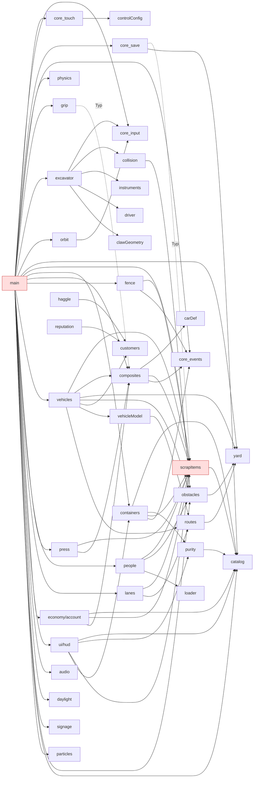

# Architektur-Review „Schrottplatz-App" (Rolle: architect)

Stand: 02.09.2026 · Geprüft: `prototype/src/**` (44 Dateien, 12 309 Zeilen), `prototype/test/**`, `docs/02_Briefing.md` Kap. 17/18/27, `docs/Pruefung/*`, `package.json`, `tsconfig.json`, `capacitor.config.json`.

**Legende:** BELEGT = selbst im Code gesehen (mit Datei:Zeile) · VERMUTUNG = Schlussfolgerung/Erfahrungswert, in diesem Projekt nicht gemessen.

**Was ich nicht prüfen konnte:** Das Projekt hat keine `node_modules`; `npm test`/`npm run build` liefen deshalb nicht (Code ist read-only, ich habe nichts installiert). Die 97 Tests habe ich durch Zählen der `it(`-Aufrufe bestätigt (18+17+15+11+3+8+9+16 = 97), nicht durch Ausführen. Keine Laufzeitmessung auf Android — alle Aussagen zur Handy-Leistung sind VERMUTUNG.

---

## 0. Kurzfassung (Top-Befunde nach Auswirkung auf den Store-Release)

1. **`main.ts` ist der eigentliche „Motor" des Spiels, nicht ein Bootstrap** — 917 Zeilen, in denen 24 Objekte von Hand erzeugt, 30 Callback-Haken gesetzt, 35 DOM-Elemente gegriffen, 29 Toasts formuliert und drei Menüs (Pause, Shop, Verhandlung) mit Logik gefüllt werden. Jede neue Funktion muss hier angeflanscht werden — das ist der Hauptgrund, warum „neue Features Bestehendes brechen". (BELEGT, Abschnitt 2)
2. **Der Event-Bus aus dem Konzept existiert, wird aber kaum benutzt.** 8 Events deklariert, 5 gefeuert, 4 abonniert — dagegen 30 direkte Callback-Zuweisungen (`grip.crusher = …`, `vehicles.onWeighIn = …`) und mehrere Module, die in fremde Interna greifen (`account.sellContainer` löscht Physik-Körper). Das Konzept in Kap. 17 („Events sind die einzige Querverbindung") ist nicht umgesetzt. (BELEGT, Abschnitt 1.5)
3. **Keine Trennung von Simulation und Darstellung.** `ScrapItem` trägt gleichzeitig Three.js-Mesh und Rapier-Körper; `excavator.ts` enthält ~660 Zeilen Modellbau neben der Kinematik; die Wirtschaft importiert Physik-Typen. Folge: nichts davon lässt sich ohne Browser testen, und jede Optik-Änderung berührt Spiellogik. (BELEGT, Abschnitt 2.3)
4. **Doppelte Wahrheiten für die Platzgeometrie**: Rapier-Kollider in `yard.ts`, eine handgepflegte Hindernisliste in `obstacles.ts`, Box-Koordinaten nochmals in `containers.ts`. Verschiebt man eine Box, muss man drei Dateien synchron ändern. (BELEGT, Abschnitt 2.4)
5. **Save-Schema deckt nur einen Teil des Zustands ab** (kein LKW, keine Presse, kein Platzwart, kein Greifer-Inhalt); Laden ist „Neustart mit Replay" und feuert dabei Spiel-Events, als sei gerade sortiert worden. (BELEGT, Abschnitt 2.6)
6. **Stack-Entscheidung:** Das Bundle besteht zu ~75 % aus Rapier (2,06 MB von 2,74 MB, base64-eingebettetes WASM); das ist harmlos. Die kritische Unbekannte ist die Physik-Schrittzeit in der Android-WebView — 12 Solver- + 6 Reibungsiterationen bei ~220 Körpern (physicsWorld.ts:16–20). **Empfehlung: Web-Stack behalten, aber v2 als Neustrukturierung (nicht als Weiterbau) — unter der Bedingung einer Go/No-Go-Messung auf einem echten Mittelklasse-Android innerhalb der ersten zwei Wochen.** Fällt sie durch: Unity (Alternativplan in Abschnitt 4).
7. Positiv und übernahmefähig: keine zirkulären Imports (BELEGT per Skript), `strict` TypeScript, ~1 700 Zeilen reine, getestete Logik (economy/*, materials/*, customers, haggle, routes, carDef, tutorial, save-Migration), gute Kommentare, saubere Datenkapselung in `carDef.ts`/`routes.ts`/`clawGeometry.ts`.

---

## 1. Modulkarte

### 1.1 Übersicht (Zweck, Zeilen, Abhängigkeiten)

„Importiert" = interne Module (Three.js/Rapier weggelassen, siehe 1.3). „Fan-in" = wie viele Module dieses Modul importieren.

| Modul | Zweck | Zeilen | Importiert | Fan-in |
|---|---|---|---|---|
| **main.ts** | Bootstrap, Spielschleife, alle Verdrahtung, drei Menüs, Save-Aufbau | 917 | 26 Module | 0 |
| core/events.ts | typisierter EventBus | 40 | – | 4 |
| core/input.ts | Tastatur/Maus, Achsen | 91 | – | 3 |
| core/touch.ts | virtuelle Sticks, Buttons, Neigung; DOM | 503 | controlConfig | 1 |
| core/controlConfig.ts | Achsbelegung, localStorage | 83 | – | 2 |
| core/save.ts | Save-Schema, Migration, localStorage | 99 | scrapItems (Typ), catalog | 1 |
| core/debugOverlay.ts | F3-Overlay | 34 | – | 1 |
| physics/physicsWorld.ts | Rapier-Wrapper, Solver-Parameter | 42 | – | 1 |
| physics/gripSystem.ts | Greifen per Fixed-Joint, Reißen, Quetschen | 241 | composites (Typ) | 1 |
| excavator/excavator.ts | Bagger: Kinematik **und** Modellbau **und** Eingabe-Mapping **und** Kollider-Sync | 1604 | input, collision, instruments, driver, clawGeometry | 1 |
| excavator/collision.ts | Arm/Fahrwerk gegen Hindernisliste | 219 | obstacles | 1 |
| excavator/clawGeometry.ts | Spinnen-Maße (eine Wahrheit für Mesh+Kollider) | 71 | – | 1 |
| excavator/instruments.ts | Kabinen-Display (Canvas-Textur) | 143 | – | 1 |
| excavator/driver.ts | Fahrer-Arme in Ego-Sicht | 90 | – | 1 |
| excavator/orbitCamera.ts | drei Kameramodi | 113 | input | 1 |
| world/yard.ts | Platz-Geometrie + Rapier-Kollider | 671 | – | 4 |
| world/obstacles.ts | handgepflegte AABB-Hindernisliste | 151 | yard | 4 |
| world/scrapItems.ts | Schrottteile: Mesh+Body+Daten, Spawner, Bündeln | 719 | catalog | **11** |
| world/containers.ts | Zonen-Zählung, Ampel, Labels; feuert Events | 514 | catalog, purity, scrapItems, events | 2 |
| world/fence.ts | zerstörbare Zaunfelder | 114 | scrapItems, events | 1 |
| world/press.ts | Schrottschere/Presse | 474 | scrapItems, composites | 1 |
| world/people.ts | Platzwart Lambert (KI, Radlader) + Wiegehäuschen | 674 | scrapItems, obstacles, loader | 1 |
| world/loader.ts | Radlader-Modell | 216 | – | 1 |
| world/daylight.ts | Tageslauf, Flutlicht | 159 | – | 1 |
| world/office.ts / signage.ts / particles.ts | Gebäude, Schilder, Partikel | 151/90/88 | – | 0–1 |
| delivery/vehicles.ts | LKW-Zustandsautomat (16 Phasen), Ladung, Waage | 1100 | scrapItems, composites, yard, obstacles, customers, vehicleModel, routes | 1 |
| delivery/vehicleModel.ts | LKW/PKW-Geometrie | 259 | routes | 1 |
| delivery/routes.ts | Wegpunkte, Zeiten, Konstanten | 130 | yard | 3 |
| delivery/customers.ts | Kundenprofile, Zufall | 303 | – | 3 |
| delivery/laneWatch.ts | Fahrspur blockiert? | 144 | scrapItems, routes | 1 |
| dismantle/composites.ts | Karossen: Quetschstufen, Scheiben, Abreißen | 427 | carDef, scrapItems, events | 5 |
| dismantle/carDef.ts | Daten der Karosse | 100 | – | 1 |
| economy/account.ts | Konto, Ankauf, Verkauf (**löscht Items**) | 125 | catalog, scrapItems, composites | 1 |
| economy/haggle.ts / reputation.ts / shift.ts / upgrades.ts | Verhandlung, Ruf, Betrieb, Ausbau — reine Logik | 138/109/92/157 | customers | 1 |
| materials/catalog.ts / purity.ts | Materialkatalog, Reinheitsformel | 47/34 | – | 7/2 |
| ui/hud.ts | HUD-DOM | 108 | catalog, purity, scrapItems, containers | 1 |
| ui/tutorial.ts | Schrittfolge, reine Logik | 147 | – | 1 |
| audio/audioManager.ts / music.ts | prozedurale Sounds, Radio | 359/219 | music | 1 |

### 1.2 Import-Graph



**Zirkuläre Abhängigkeiten: keine.** BELEGT — ich habe den Graphen per Skript (Tiefensuche über alle `from '…'`-Imports) geprüft: 0 Zyklen. Das ist ein echtes Plus; Vite-Projekte mit zyklischen Imports produzieren schwer erklärbare `undefined`-Fehler beim Start.

**Nabe des Graphen:** `world/scrapItems.ts` (Fan-in 11). Weil `ScrapItem` (scrapItems.ts:253–269) gleichzeitig `mesh: THREE.Object3D` und `body: RAPIER.RigidBody` enthält, zieht jedes Modul, das mit Schrott rechnet — auch `economy/account.ts` und `ui/hud.ts` — Three.js und Rapier mit. Das ist die zentrale Kopplung des Projekts.

### 1.3 Was hängt an Three.js / Rapier?

BELEGT per grep: **24 von 44** Dateien importieren Three.js, **13** importieren Rapier. Frei davon sind nur: core/events, core/input, core/controlConfig, core/save, core/debugOverlay, materials/*, economy/haggle|reputation|shift|upgrades, delivery/customers, dismantle/carDef, ui/tutorial, ui/hud (DOM), audio/*. Genau diese Menge ist es, die getestet ist (siehe 1.7).

### 1.4 God-Objects

| Datei | Zeilen | Was darin alles steckt (BELEGT) |
|---|---|---|
| `excavator/excavator.ts` | 1604 | (a) Bewegungsmodell mit Rampen/Lastfaktor (`update`, 1015–1176); (b) **Tastenbelegung fest verdrahtet in der Simulation**: `input.axis("KeyS","KeyW")`, `axis2(input,"KeyE","KeyQ","ArrowRight","ArrowLeft")` (1033–1057) plus paralleler Touch-Pfad `this.touch?.drive`; (c) ~660 Zeilen Meshbau: `buildHydraulics` 192–253, `buildMeshes` 306–529, `buildCabin` 566–774, `buildOutriggers` 775–823, `buildNamePlate` 824–852, `buildBoomLogo` 853–894, `buildBlade` 1474–1519; (d) Kollider-Sync `syncBodies` 1380–1473; (e) Pendel-Physik `integratePendulum` 1314–1353; (f) Kollisionsbehandlung mit Rückstellung (1131–1164); (g) Kamera-Ankerpunkte, Instrumente, Ego-Sicht. Sieben Verantwortlichkeiten in einer Klasse. |
| `main.ts` | 917 | Bootstrap (47–197), Boot-aus-Save (103–145), Pausenmenü (251–270), Steuerungsmenü (272–319), Abhol-Bestellung (321–358), 30 Callback-Haken (367–459, 546–606), Shop mit Kauflogik (445–495), Verhandlungs-UI mit Preislogik (497–543), fester Physik-Step (610–637), Dev-Handle (640–670), Frame-Loop mit Tastenauswertung, HUD, Tutorial-Fortschritt, Zahlungsfähigkeit, Ladungsanzeige, Audio, Partikel (683–909). Das ist kein Bootstrap, sondern der Spielzustand selbst: `preisFaktor`, `zahlungsUnfaehig`, `tutSortiertKg`, `tutGepresst`, `tutAbholer`, `tutPreis`, `looseKg`, `labelsOn`, `paused` sind lokale Variablen von `main()` (203–252, 500–501, 681). |
| `delivery/vehicles.ts` | 1100 | Zustandsautomat mit 16 String-Phasen (47–64) und 8 hart codierten Zeitschwellen (`phaseT > 2.5`, `> 32`, `> 240` …) in `update` (637–838); Ladung als kinematisch mitgeführte Körper; Waage-Logik; Despawn-Regeln; dazu `VehicleManager` mit Spawn-Takt, Bestellung, Hindernis-Export. Modellbau ist immerhin in `vehicleModel.ts` ausgelagert (gut). |
| `world/scrapItems.ts` | 719 | Geometrie-Fabrik, Kollider-Fabrik, Spawner, Bündeln (`consolidate`), Plattdrücken, Geschwindigkeits-Clamp, Highlight, Mesh-Sync — Daten, Physik und Optik in einer Klasse. |
| `world/people.ts` | 674 | Figur-Modellbau, Wiegehäuschen, Lambert-KI mit Wegfindung, Radlader-Steuerung. |

### 1.5 EventBus vs. direkte Zugriffe

BELEGT:
- `core/events.ts` deklariert 8 Events. Gefeuert werden 5: `fenceBroken` (fence.ts:112), `itemLeft`/`itemEntered` (containers.ts:454/457), `glassShattered`/`crushed`/`partTorn` (composites.ts:249/262/315). **`grabbed` und `released` werden nirgends gefeuert**; `itemLeft` und `partTorn` werden gefeuert, aber **niemand hört zu** (main.ts abonniert nur `itemEntered`, `glassShattered`, `crushed`, `fenceBroken`: 397–423).
- Dem stehen **30 Callback-Felder** gegenüber, die `main.ts` von Hand setzt: `gripSystem` 8 (`getViolence`, `getCapacityBonus`, `onGrabbed`, `onReleased`, `onTear`, `partResolver`, `insideGrapple`, `crusher`), `vehicles` 7, `people` 5, `press` 4, `excavator` 2, `touch` 1. Jedes Feld ist `… | null = null` und wird in der Klasse mit `?.()` aufgerufen — d. h. vergisst man in main die Zuweisung, läuft das Spiel **stumm falsch** weiter (z. B. gripSystem.ts:38–53).
- **Direkte Eingriffe in fremde Interna:**
  - `economy/account.ts:79–121` `sellContainer` bekommt `ItemManager` und `CompositeManager` und ruft `items.remove(it, !wasCar)` — die Wirtschaft entfernt Physik-Körper aus der Welt.
  - `main.ts:617–624` schreibt in `excavator.grippedHandles` und `excavator.obstacleBodies` (öffentliche Sets), `main.ts:614–615` setzt `excavator.carriedMassKg/-Count` aus `grip`.
  - `main.ts:530, 572` setzt `vehicles.dealPending` von außen; `main.ts:847, 856` setzt `vehicles.acceptDeliveries`, `vehicles.intervalFactor` jeden Frame.
  - `main.ts:388` sucht Items linear per `items.items.find(i => i.body.handle === …)`, obwohl `ItemManager.itemByBody` mit Map existiert (scrapItems.ts:627) — Zeichen, dass main die Modul-API umgeht.
  - `ui/hud.ts` importiert `ScrapItem`, `ContainerManager` — UI kennt Physik-Typen.

Fazit: Die Kommunikationsarchitektur ist de facto „main kennt alle, alle rufen main-Callbacks". Kap. 17 des GDD beschreibt etwas anderes als das, was gebaut wurde.

### 1.6 Globale Zustände

BELEGT:
- `window.__game` (main.ts:640–670) — nur im Dev-Build (`import.meta.env.DEV`), exportiert 22 Objekte für Konsolen-Smoke-Tests. Im Release nicht enthalten: unkritisch.
- `localStorage` an drei Stellen: Save (save.ts:76/85/95), Steuerungs-Config (controlConfig.ts:61/78). Kein Capacitor-Preferences/Filesystem-Pfad, obwohl GDD Kap. 17 ihn vorsieht. Auf Android-WebView ist `localStorage` an die WebView-Daten gebunden — „App-Daten löschen" oder ein WebView-Update-Fehler löschen den Spielstand (VERMUTUNG bezüglich Häufigkeit, Mechanismus ist bekannt).
- Modul-Singletons: `STATIC_OBSTACLES` (obstacles.ts), `CONFIGS` (containers.ts:50ff), `MATERIALS`, `UPGRADES`, `STEPS` — reine Daten, in Ordnung.
- Der eigentliche „globale Zustand" sind die **Closure-Variablen in `main()`** (siehe 1.4): unsichtbar für Tests, nicht serialisierbar, nur über den Frame-Loop erreichbar.

### 1.7 Tests und Testbarkeit

BELEGT: 8 Vitest-Dateien, 97 `it(`. Alle importieren ausschließlich aus der Three/Rapier-freien Menge (economy, materials, customers, tutorial, save-Migration, obstacles/routes, clawGeometry). **Nichts** aus excavator (außer Geometrie-Konstanten), gripSystem, containers, vehicles, composites, press, people ist getestet. Grund ist kein Fleiß-, sondern ein Architekturproblem: Diese Klassen brauchen `THREE.Scene` **und** `RAPIER.World` **und** DOM im Konstruktor (z. B. `ContainerManager(scene, world, bus)`, containers.ts:404; `Excavator(scene, world)`, excavator.ts:178). Dabei liefe Rapier in Node problemlos — eine kopflose Simulation (ohne Renderer) wäre mit einem anderen Schnitt testbar.

---

## 2. Warum „neue Features brechen Bestehendes" — Belege

### 2.1 main.ts orchestriert per Hand und hält den Zustand

Jede Erweiterung der letzten Wochen hat in `main.ts` Spuren hinterlassen: Verhandlung (497–579), Ausbau (445–495), Zahlungsdruck (845–855), Tutorial-Signale (208–211, 343, 430, 531), Fahrspur-Störfall (202–203, 825–830). Diese Blöcke teilen sich lokale Variablen und beeinflussen einander über Reihenfolge — z. B. wird `preisFaktor` in drei Handlern gesetzt (513, 533, 567, 575, 590) und in einem vierten verbraucht (582). Wer ein neues Kundenverhalten einbaut, muss alle fünf Stellen kennen. Es gibt keine Stelle, an der man ein Feature *isoliert* hinzufügen kann.

### 2.2 Update-Reihenfolge ist implizit

`stepOnce` (main.ts:610–637) legt fest: Bagger → Greifer → Hindernis-Sets → Physik → Clamp → Karossen → Zaun → LKW → Presse → Platzwart → (alle 10 Steps) Container-Zählung. Der Frame (683–909) danach: Mesh-Sync → Kamera → Render → HUD → Tageslicht → Bündeln → Fahrspur → Tutorial → Betrieb → LKW-Parameter → Instrumente → Ladungsanzeige → Konto-HUD → Audio → Partikel. Diese Reihenfolge ist nirgends deklariert, nur durch die Zeilenfolge gegeben. Beispiel für versteckte Abhängigkeit: `vehicles.obstacleHandles(excavator.obstacleBodies)` (619) muss **vor** `physics.step()` laufen, `containers.recount` erst nach `grip.update`, sonst zählen gegriffene Teile als „im Container". Ein neues System, das an falscher Stelle eingehängt wird, verursacht Ein-Frame-Verzögerungen oder Doppelzählungen, die wie Physik-Bugs aussehen.

Zusätzlich: Feste 60-Hz-Physik (FIXED_DT, main.ts:43) mit bis zu 5 Nachhol-Steps. Auf einem Handy mit 30 fps laufen damit 2 Physik-Steps pro Bild — die Physiklast pro Bild verdoppelt sich genau dort, wo sie am wenigsten Reserve hat (VERMUTUNG über die Folge, der Mechanismus ist BELEGT).

### 2.3 Keine Trennung Simulation / Darstellung

- `ScrapItem` = Daten + Mesh + Body (scrapItems.ts:253–269). Save-Aufbau muss darum Körper abfragen (main.ts:175–187).
- `excavator.ts`: 660 Zeilen Modellbau in der Simulationsklasse; `update()` ruft `syncMeshes()` dreimal (1129, 1137, 1156), weil die Kollisionsprüfung an Mesh-Weltmatrizen hängt — Optik ist Teil der Kollisionslogik.
- Eingabe liegt **in** der Simulation: Tastencodes in excavator.ts:1033–1057; Touch-Buttons erzeugen Tastencodes (`bindTap("btn-cab","KeyX")`, touch.ts:86–96), die main als `touch.consumePress("KeyX")` wieder auswertet (main.ts:700–702). Ein Gamepad oder eine Belegungsänderung muss also an drei Stellen nachgezogen werden.
- `vehicles.ts:805–809, 828–835` allokiert in jedem Physik-Step `new THREE.Quaternion()`/`Vector3()`; grep zählt 25 solcher Neuerzeugungen in Update-Pfaden von vehicles/people/containers/press. Auf Desktop unsichtbar, auf Android GC-Ruckler (VERMUTUNG über Sichtbarkeit).

### 2.4 Doppelte Wahrheiten

- Platzgeometrie dreimal: Rapier-Kollider in `yard.ts` (z. B. 618), Hindernis-AABBs in `obstacles.ts` (mit eigenem `BAY_X = 4.6`, Z. 36), Box-Koordinaten `x: 4.6` nochmals in `containers.ts:54–57`. Die Selbsteinschätzung berichtet, dass der Routen-Test „zwei echte Blockaden gefangen" hat (Pruefung/01:188–191) — genau das Symptom.
- Konstanten im Kopf statt in Daten: `docs/02_Briefing.md:448` sieht `data/*.json` vor; es gibt kein `data/`-Verzeichnis. Zahlen stehen als 129 `const X = <Zahl>`-Deklarationen im Quelltext (grep), dazu unbenannte Literale (`phaseT > 32`, `> 240`, `0.06`, `1.35`, `1.5`, `1.6`, `1.4` für Upgrade-Wirkungen in main.ts:456–459). Balancing = Code-Änderung = Regressionsrisiko.
- Abläufe zweifach: „Abholung" ist ein Ablauf in `vehicles.requestPickup`, in `main.ts:719–728` (Taste V) **und** in `showPickup` (324–357).

### 2.5 Fehlende Zustandsmaschine auf Spielebene

Es gibt Zustände wie „verhandelt gerade", „pausiert", „Shop offen", „Tutorialschritt", „zahlungsunfähig" — aber jeder lebt in einer eigenen Variable/DOM-Klasse (`haggleEl.classList.contains("open")`, main.ts:833 als Zustandsabfrage!). Neue Features (Missionen!) bräuchten einen definierten Spielzustand; heute gibt es keinen Ort dafür. Das erklärt auch Punkt 5 des Auftraggebers (Missionen unklar): ohne Zustandsmodell kann man keine Ziele formulieren, die das Spiel selbst prüft.

### 2.6 Save-Schema

BELEGT (save.ts:29–45, main.ts:166–190):
- Gespeichert: Geld, Betrieb, Ruf, Tutorial, Ausbau, Tageszeit, lose Items (Position/Rotation/Form), Karossen, Zaun-Flags.
- **Nicht** gespeichert: aktuell anwesender LKW und Phase, Presse-Zustand, Platzwart, Greifer-Inhalt, Bagger-Position/-Armstellung, Container-Zuordnung, `account.sortedKg/purchasedKg`, Bestellung (`pickupOrder`). Nach dem Laden steht der Bagger wieder am Start, der LKW ist weg, der Deal vergessen.
- Laden = Seite neu laden und aus dem Save booten (main.ts:103–121, 266). Dabei werden alle Items neu erzeugt mit `containerId = null`; die erste `recount` nach 10 Steps feuert für jedes Teil in einer Zone `itemEntered` (containers.ts:457), worauf main `account.noteSorted` und Tutorial-Zähler erhöht und `playCorrect()` auslöst (main.ts:397–409). Der Spielstand „sortiert sich beim Laden selbst nochmal". (Code-Pfad BELEGT; hörbare Folge VERMUTUNG, weil Audio erst nach Nutzergeste startet.)
- `schemaVersion: 1` mit Migrationshaken ist gut angelegt (save.ts:52–72) — aber jede Feld-Erweiterung erfolgt in `main.ts` (buildSaveData) statt in den Modulen, die den Zustand besitzen.
- Speicherort `localStorage` (siehe 1.6) — auf Android kein Backup, keine Datei.

### 2.7 Zusammenfassung des Mechanismus

„Feature X hinzufügen" bedeutet heute: (1) Klasse anlegen, (2) in `main()` konstruieren, (3) Callbacks setzen, (4) an der richtigen Stelle in `stepOnce`/`frame` einhängen, (5) HUD/Toast in main schreiben, (6) `buildSaveData` und `SaveData` erweitern, (7) Boot-Pfad erweitern, (8) `obstacles.ts` pflegen, falls etwas auf dem Platz steht, (9) Tastencode in input + touch + main eintragen. Neun Stellen, keine davon durch Typen oder Tests abgesichert. Das ist nicht „Code wird unübersichtlich" als Geschmacksfrage, sondern ein struktureller Grund für Regressionen.

---

## 3. Modulbewertung

Qualität 1–5 (5 = sehr gut) · Testbarkeit: ✔ kopflos testbar / ◐ mit Umbau / ✘ braucht Browser · v2: **Ü** = übernehmen (ggf. portieren), **R** = neu schreiben (Design übernehmen), **T** = teilweise.

| Modul | Q | Test | v2 | Begründung |
|---|---|---|---|---|
| economy/haggle, reputation, shift, upgrades | 4 | ✔ | Ü | Reine Funktionen/kleine Klassen, getestet, kommentiert. Formeln (Kap. 27) sind stack-unabhängig. |
| economy/account | 3 | ◐ | T | Preislogik gut; `sellContainer` mit Weltzugriff gehört raus. |
| materials/catalog, purity | 4 | ✔ | Ü | Daten + reine Formeln. In v2 als JSON. |
| delivery/customers, haggle-Profile | 4 | ✔ | Ü | Datengetrieben, getestet. |
| delivery/routes | 4 | ✔ | Ü | Gute Idee (Wegpunkte gebündelt); in v2 aus Level-Daten ableiten statt Handkoordinaten. |
| delivery/vehicles | 2 | ✘ | R | 16-Phasen-Automat mit Magic-Numbers, Allokationen im Step, kinematische Ladung als Sonderweg. Ablauf-Design übernehmen, Code neu als Zustandsmaschine mit Daten. |
| delivery/vehicleModel, laneWatch | 3 | ✘/◐ | T | Modell nur für Web-v2 nützlich; laneWatch-Logik übernehmbar. |
| dismantle/carDef | 4 | ✔ | Ü | Sauber datengetrieben. |
| dismantle/composites | 3 | ◐ | T | Mechanik (Δv-Erkennung, Quetschstufen, Reißen) ist gut durchdacht; Klasse mischt Mesh-Squash und Physik. Logik übernehmen, Darstellung trennen. |
| excavator/excavator | 2 | ✘ | R | Kinematik-Modell (`update` 1015–1176, Rampen, Lastfaktor, Bodenklemme, Pendel) ist der wertvolle Kern und übernehmbar — als ~300-Zeilen-Modul ohne Meshbau, Eingabe und Kollider. Rest neu. |
| excavator/collision | 3 | ◐ | T | Funktioniert gegen Hindernisliste; in v2 durch Physik-Queries (Shape-Cast) ersetzen. |
| excavator/clawGeometry, instruments, driver, orbitCamera | 4/3/3/3 | ✔/✘ | Ü/T | clawGeometry ist vorbildlich („eine Wahrheit"). Kamera-Modi übernehmen. |
| physics/physicsWorld | 3 | ✔ | Ü | Dünn, gut; Parameter (12/6 Iterationen) sind ein Performance-Risiko → in Config. |
| physics/gripSystem | 3 | ◐ | T | Greif-Fenster, Reißen, Quetschen: gutes Design. 8 Callback-Haken → in v2 Interfaces/Events. Braucht nur Rapier, wäre kopflos testbar, wenn `TearTarget`-Typ ohne composites käme. |
| world/scrapItems | 2 | ✘ | R | Nabe des Graphen, vermischt alles. Spawner-Daten (Formen, Masse-Verteilungen) übernehmen. |
| world/containers | 3 | ◐ | T | Zonen-Zählung mit Events ist richtig gedacht; Label-Rendering trennen. |
| world/yard, obstacles | 2 | ◐ | R | Drei Wahrheiten. In v2 eine Level-Definition (JSON), aus der Kollider, Hindernisse und Zonen generiert werden. |
| world/press, fence, people, loader, daylight, office, signage, particles | 3 | ✘ | T | Verhalten übernehmen, Code an v2-Schnitt anpassen; people.ts (KI + Modell) aufteilen. |
| core/events | 3 | ✔ | Ü | Korrekt, aber zu klein genutzt; in v2 mit `off()`, Priorität, ggf. Frame-Queue. |
| core/input, touch, controlConfig | 3/3/4 | ✘ | T | Touch-Umsetzung (Pointer-Capture, Zoom-Sperre, Druckgriff, Neigung) ist praktisch wertvoll; Tastencode-Emulation ersetzen durch Aktions-Abstraktion. |
| core/save | 3 | ✔ | T | Migrationsgerüst übernehmen; Inhalt neu (vollständiger Zustand, modulweise). |
| ui/hud | 2 | ✘ | R | Greift auf feste IDs; kennt Physik-Typen. |
| ui/tutorial | 4 | ✔ | Ü | Reiner Sequencer mit Kontext-Objekt — so sollte auch ein Missions-System aussehen. |
| audio/* | 3 | ✘ | T | Prozedurales Audio ohne Assets ist für Store-Release (GEMA) klug; API in v2 auf Events umstellen. |
| main.ts | 1 | ✘ | R | Siehe Abschnitt 2. |

**Bilanz:** Rund 1 700 Zeilen (14 %) sind direkt übernehmbar (Ü), ~5 500 Zeilen (45 %) liefern Design/Algorithmen, die in neuem Schnitt weiterleben (T), ~5 100 Zeilen (41 %: main, excavator-Meshbau, vehicles, scrapItems, yard/obstacles, hud) sollten neu entstehen. Das gilt **innerhalb** des Web-Stacks. Bei Engine-Wechsel sinkt „Ü" auf null Zeilen Code (Sprachwechsel), bleibt aber als Formeln/Daten/Tabellen erhalten.

---

## 4. Stack-Empfehlung

### 4.1 Fakten aus diesem Code

| Frage | Befund | Status |
|---|---|---|
| Physiklast | 218 Körper / 108 wach, Physik-Step 2,78 ms auf Desktop (Pruefung/01:218–222). Solver: `numSolverIterations = 12`, `numAdditionalFrictionIterations = 6`, `contact_natural_frequency = 40` (physicsWorld.ts:16–20) — das ist das 3-fache der Rapier-Standardwerte (4 Iterationen). Dazu 60-Hz-Fixed-Step mit Nachholen. | Desktop BELEGT (übernommen), Handy VERMUTUNG: ×3–5 → 8–14 ms allein Physik = nicht mehr 60 fps, 30 fps eng. |
| Bundle 2,74 MB | `@dimforge/rapier3d-compat` liefert `rapier.es.js` mit **2,06 MB** (WASM 1,44 MB als base64 eingebettet; per `npm pack` nachgesehen). Three.js ≈ 0,6 MB, Spielcode ≈ 0,1 MB. Gzip 949 kB. | BELEGT. Für den Store irrelevant (Capacitor-APK bündelt lokal; keine Downloadzeit). Ladezeit: base64-Dekodierung des WASM beim Start ~0,3–1 s auf Mittelklasse (VERMUTUNG). Mit `rapier3d` (nicht-compat) + Vite-WASM-Plugin wäre das WASM direkt ladbar und SIMD-Variante möglich. |
| Rapier in WebView | Android System WebView = Chromium; WASM, WebGL2 und `SharedArrayBuffer`-frei ist alles vorhanden. Kein Hinweis auf Verwendung von Threads/SIMD. | Kompatibilität BELEGT per Stack (keine exotischen APIs im Code), Tempo VERMUTUNG. |
| Multi-Touch in WebView | touch.ts nutzt Pointer Events mit `setPointerCapture` (160–190), sperrt Browser-Zoom, Doppeltipp, Kontextmenü (122–150), erkennt Druck (`pressureSupported`) und Neigung (`deviceorientation`, 393). Zwei Sticks + Halte-Buttons gleichzeitig sind damit korrekt implementiert. | Implementierung BELEGT; ob die WebView bei 3+ gleichzeitigen Fingern und Systemgesten (Zurück-Wischen, Navigationsleiste) sauber bleibt, ist NICHT gemessen — bekanntes Risiko: Android-Rand-Gesten sind aus der WebView nicht abschaltbar (VERMUTUNG/Erfahrung). |
| Store-Anforderungen | Premium 4,99 € = Kaufpreis auf der Store-Seite, kein Billing-SDK nötig; AAB, Target-API, Signierung übernimmt Capacitor/Gradle (docs/10). Play verlangt keine native Engine. Für iOS später: WKWebView, WebGL2 seit iOS 15 — machbar. | BELEGT (Doku), kein Blocker für Web. |
| Was bleibt bei Wechsel? | Siehe 3: 0 Zeilen Code, aber alle Formeln, Daten (Materialien, Kunden, Karosse, Routen, Tutorial), das Kinematik-Modell als Algorithmus und das Touch-Layout als Design. | BELEGT (Zählung). |

### 4.2 Abwägung

**Web (Three.js + Rapier + Capacitor) beibehalten**
- Pro: 12 k Zeilen Erfahrung im Team/Agent-Workflow; ~60 % der Substanz überlebt eine Neustrukturierung; Iteration im Browser in Sekunden; keine Engine-Lizenz; prozedurales Audio/Modelle ohne Asset-Pipeline; Rapier ist deterministisch und läuft in Node → Simulation kopflos testbar.
- Contra: WebView-Leistung ist die eine große Unbekannte und **nicht vom Entwickler steuerbar** (kein Profiler-Zugriff wie in Unity, keine Kontrolle über GPU-Treiber-Pfade); Rand-Gesten und Audio-Autoplay-Regeln der WebView; kein Editor für Level-Layout (deshalb die Handkoordinaten in obstacles/containers/routes).

**Unity**
- Pro: Beste Mobile-3D-Reife, PhysX/Burst, Profiler auf Gerät, Editor für Platz-Layout (die „drei Wahrheiten" verschwinden, weil Kollider/Zonen aus der Szene kommen), Store-Pipelines (IAP, Cloud-Save) fertig. Personal-Lizenz kostenlos unter der Umsatzschwelle; die Runtime-Fee wurde 2024 zurückgenommen.
- Contra: 100 % Neuschreiben in C#; Bagger-Kinematik, Greifer mit Joints, Karossen-Quetschstufen müssen erneut gefunden werden — die „unrunde" Physik (Punkt 2 des Auftraggebers) ist ein **Tuning-Problem**, das Unity nicht löst, nur verlagert; Build-Zeiten Minuten statt Sekunden; für KI-agentengetriebene Entwicklung schlechter (Szenen-Dateien statt Code).

**Godot 4 (Jolt-Physik, GDScript/C#)**
- Pro: frei, klein, Editor, Android-Export einfach, Jolt ist eine sehr gute Physik.
- Contra: 3D auf Mittelklasse-Android ist weniger optimiert und mit weniger Praxisberichten als Unity (VERMUTUNG/Erfahrung); C#-Export für iOS war lange eingeschränkt — vor Entscheidung prüfen; ebenfalls 100 % neu.

**Entscheidender Punkt:** Von den fünf genannten Schmerzen sind **1 (Architektur), 2 (Physik-Gefühl) und 5 (Missionen) stack-unabhängig** — sie entstehen aus dem Schnitt des Codes bzw. fehlendem Spielzustand, nicht aus Three.js. Nur **3 (FPS) und 4 (Touch)** hängen an der WebView, und dort fehlt schlicht die Messung.

### 4.3 Empfehlung

**Web-Stack behalten, v2 als Neustrukturierung — mit einem harten Messtor in Woche 1–2.**

1. **Woche 1–2: Go/No-Go-Messung** (bevor eine Zeile v2 geschrieben wird): Capacitor-Build des heutigen Prototyps auf ein echtes Mittelklasse-Android (z. B. Snapdragon 6xx/7xx, 4–6 GB RAM). Messen: Physik-Step und Frame-Zeit bei 220 Körpern (Debug-Overlay ist da: `F3`, `physics.counts()`); dasselbe mit Solver-Iterationen 4/2 statt 12/6; Touch-Test mit zwei Sticks + Griff-Button gleichzeitig; Rand-Gesten.
   - **Go**, wenn: ≥ 30 fps stabil mit Reserve (Frame < 25 ms) **und** Touch zuverlässig. Dann v2 im Web (Abschnitt 5).
   - **No-Go**, wenn: Physik allein > 12 ms oder Touch verliert Finger. Dann **Unity** (Alternativplan): Formeln/Daten 1:1 in C# portieren, Bagger als kinematische Kette mit denselben Rampen, Greifer mit `FixedJoint`/`ConfigurableJoint`, Schrott als Rigidbodies mit Sleep. Aufwand: Größenordnung 3–4 Monate für Feature-Parität mit heutigem Stand, da Design und Zahlen vorliegen (VERMUTUNG, Erfahrungswert).
2. Unabhängig vom Ergebnis: **nicht am heutigen `main.ts` weiterbauen.** Jede Woche Weiterbau erhöht die Zahl der Stellen aus 2.7.

Was auch im Web sofort Leistung bringt (BELEGT als Ansatzpunkt, Wirkung VERMUTUNG): Solver-Iterationen senken und stattdessen `contact_natural_frequency` nutzen; Physik-Rate auf 30 Hz mit Interpolation umstellbar machen; `rapier3d` statt `-compat`; keine Allokationen im Step; Container-Zählung und Bündeln ereignisgesteuert statt per Timer; Schatten-Map 2048 (main.ts:68) auf Mobil halbieren.

---

## 5. Ziel-Architektur v2 (stack-neutral formuliert, Beispiele in TS)

### 5.1 Schichten

```
┌──────────────────────────────────────────────────────────┐
│ Präsentation   Renderer-Adapter (Three) · HUD/Menüs · Audio · Partikel     │  liest nur Snapshots + Events
├──────────────────────────────────────────────────────────┤
│ Anwendung      GameLoop · SystemScheduler · SaveService · InputMapper       │  kennt Sim-API, nicht Three
├──────────────────────────────────────────────────────────┤
│ Simulation     World-State (reine Daten) · Systeme (Bagger, Greifer, LKW,   │  Rapier ja, Three/DOM nein
│                Container, Presse, Platzwart, Betrieb, Missionen)             │  → kopflos in Vitest lauffähig
├──────────────────────────────────────────────────────────┤
│ Daten          materials.json · customers.json · cars.json · level.json ·    │  Balancing ohne Code
│                upgrades.json · missions.json · controls.json                 │
└──────────────────────────────────────────────────────────┘
```

Regel: Abhängigkeiten zeigen nur nach unten. Die Simulation darf **nie** `THREE` oder `document` importieren — das ist per ESLint-Regel (`no-restricted-imports` pro Ordner) erzwingbar und der eine Check, der die heutige Vermischung dauerhaft verhindert.

### 5.2 Kernbausteine

- **Entitäten als reine Daten** (`ScrapItem { id, materialId, massKg, shape, bodyHandle, containerId, composition }`). Mesh-Zuordnung lebt in einer `ViewRegistry` (Map id→Object3D) der Präsentationsschicht. Save = Serialisierung dieser Daten + Body-Pose, ohne Sonderpfade in main.
- **Systeme mit deklarierter Reihenfolge und Phase:**
  ```ts
  interface System { name; phase: "preStep"|"postStep"|"frame"; order: number;
                     update(ctx: SimContext, dt: number): void; save?(): unknown; load?(d: unknown): void }
  ```
  Der Scheduler sortiert nach `phase/order` und loggt die Reihenfolge — die implizite Reihenfolge aus main.ts:610–637 wird explizit und prüfbar. Ein neues System = eine Datei + eine Registrierung.
- **Ein Spielzustand-Modell** (`GameState`: `playing | paused | menu(shop|haggle|pickup) | tutorialStep | missionState`), von dem Eingabe-Mapper und UI ablesen; kein `classList.contains("open")` als Wahrheit.
- **Aktions-basierte Eingabe:** `InputMapper` erzeugt aus Tastatur/Touch/Gamepad einen `ControlFrame { drive, steer, cab, boom, stick, grapple, actions: Set<Action> }`. Die Bagger-Simulation kennt nur `ControlFrame`; die freie Belegung (controlConfig.ts, gut!) wird zum einzigen Ort für Mapping.
- **Event-Bus als einzige Aufwärtsrichtung:** Simulation → Events (`itemEntered`, `saleCompleted`, `truckArrived`, `partTorn`, `grabbed`, …) → Präsentation/Audio/Tutorial/Missionen. Abfragen nach unten über kleine Interfaces (`obstacleQuery.hits(x,z)`), nicht über 30 nullable Callback-Felder. Kein System hält Referenzen auf ein anderes System; Zugriff über `ctx.get(ContainerSystem)`.
- **Level-Definition** (`level.json`: Wände, Boxen, Zonen, Wegpunkte, Spawn-Flächen). Daraus werden **generiert**: Rapier-Kollider, Hindernisliste für kinematische Akteure, Container-Zonen, Routen. Ein Test prüft, dass Routen hindernisfrei sind (den gibt es heute schon — er wird dann nie wieder von Hand nachgepflegt).
- **Bagger** in drei Teile: `ExcavatorModel` (Zustand+Kinematik, ~300 Zeilen, getestet), `ExcavatorColliders` (Rapier-Sync, Kollision per Shape-Cast statt AABB-Liste), `ExcavatorView` (Meshes, Hydraulik-Animation, Instrumente).
- **LKW** als datengetriebene Zustandsmaschine (`phases.json` mit Dauer/Bedingung), Ladung über ein `RidingCargo`-Subsystem.
- **Missionen/Ziele**: wie `ui/tutorial.ts` heute — ein Sequencer mit `Context`-Objekt, der Bedingungen aus Events/Snapshots prüft und Ziele/Belohnungen aus `missions.json` liest. Damit werden Missionen definierbar, ohne Code (adressiert Schmerz 5).
- **Persistenz**: jedes System liefert `save()/load()`; `SaveService` fügt Schema-Version + Migrationen hinzu; Speicherort per Adapter (Web: IndexedDB, Android: Capacitor Filesystem).

### 5.3 Datenfluss pro Bild

```
Input-Geräte → InputMapper → ControlFrame ─┐
                                          ▼
   Scheduler: preStep-Systeme (Bagger, Greifer, LKW-Kinematik) → Rapier.step() → postStep (Container-Zählung, Karossen, Zaun, Presse, Platzwart, Betrieb, Missionen)
                                          │ Events + Snapshot (read-only)
                                          ▼
   frame-Systeme: ViewSync (Body-Pose → Mesh), Kamera, HUD, Audio, Partikel, Tageslicht → Render
```

### 5.4 Wie Erweiterungen isoliert bleiben

- Neues Feature = neues System + neue Events + ggf. neue JSON-Daten. Kein Eingriff in main, keinen Callback setzen, keine Save-Änderung außerhalb des Systems.
- Zwei Testebenen: (a) Unit-Tests für Formeln (wie heute); (b) **Szenario-Tests der kopflosen Simulation**: „Spawne 150 Teile, greife eines, lege es in Box ALU, erwarte `itemEntered{correct:true}` innerhalb 60 Steps" — ohne Browser, in Vitest, weil Rapier in Node läuft. Diese Ebene fehlt heute komplett und ist der wirksamste Schutz gegen „Feature bricht Bestehendes".
- Ein Lint-Gate (Importverbote je Schicht) und ein Reihenfolge-Snapshot des Schedulers im Test.
- Balancing-Werte ausschließlich aus JSON, mit Schema-Validierung beim Laden.

### 5.5 Migrationspfad im Web (falls Go)

Nicht „alles wegwerfen", sondern schichtweise: (1) Scheduler + `ControlFrame` + Lint-Gate einziehen und die heutigen Systeme unverändert registrieren; (2) `ScrapItem` von Mesh trennen (ViewRegistry); (3) Bagger dreiteilen; (4) Level-JSON und Generatoren, obstacles.ts löschen; (5) Save modulweise; (6) LKW-Automat datengetrieben; (7) Missionssystem auf Tutorial-Muster. Jede Stufe hinterlässt ein spielbares Spiel. Reine Logik-Module (economy, materials, customers, tutorial, carDef, routes) bleiben unangetastet.

---

## Anhang: Prüfmethode

- Zeilen: `wc -l` über `src/**/*.ts`. Import-Graph: grep auf `from '…'`, Zyklensuche per Node-Skript (0 Zyklen). Callback-Felder: grep auf `on[A-Z]…|get[A-Z]…: (…) | null`. Globale Zustände: grep auf `window.`, `localStorage`, `getElementById`. Bundle-Zusammensetzung: `npm pack @dimforge/rapier3d-compat@0.14.0` (rapier.es.js 2 059 628 Byte, WASM 1 439 831 Byte).
- Nicht ausgeführt: Tests, Build, Dev-Server, Android-Build, Laufzeitmessungen.
